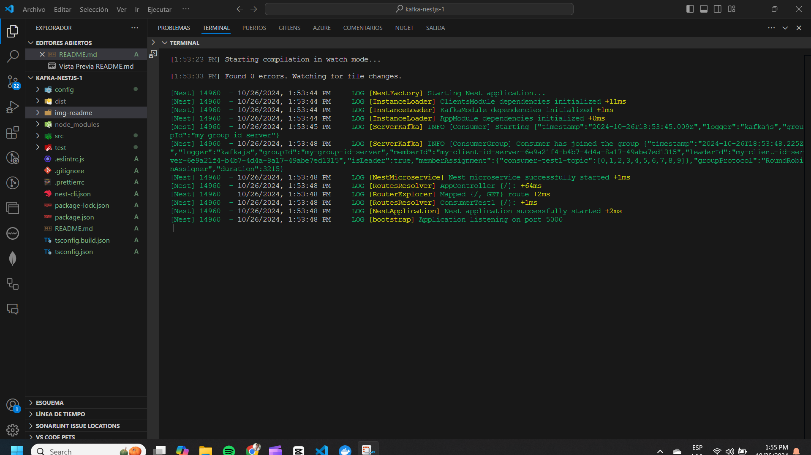

# Proyecto de Producción de Mensajes con NestJS y Kafka

Este proyecto implementa un servicio de producción de mensajes utilizando [NestJS](https://nestjs.com/) y [Kafka](https://kafka.apache.org/). El servicio se encarga de enviar mensajes a un clúster de Kafka, permitiendo la integración y comunicación de sistemas mediante un sistema de mensajería distribuida.

Esta implementación se realiza de forma sencilla para dar una explicación clara de cómo realizarla. No se profundiza en carácteristicas de kafka ni en definiciones de tipos de datos para los mensajes que se consumen o se producen, ni se implementan varios consumer a diferentes topic.

Si deseas ver una implementación más detallada y completa de kafka en nestjs, pueden ver mi otro proyecto de nestjs con kafka [aquí]()

## Descripción del Proyecto

El proyecto utiliza **NestJS** como framework para construir una aplicación robusta y escalable que produce mensajes para un clúster de **Apache Kafka**. Kafka es una plataforma de mensajería distribuida que permite enviar y recibir mensajes de manera eficiente y con alta disponibilidad.

La implementación del servicio se basa en la documentación oficial de NestJS, usando el paquete [@nestjs/microservices](https://docs.nestjs.com/microservices/kafka) para conectar y manejar la comunicación con el clúster de Kafka.

## Características

- Conexión a un clúster de Kafka.
- Producción de mensajes en formato JSON.
- Configuración flexible para manejar tópicos y configuraciones de Kafka.

## Requisitos Previos

- Node.js (v20 o superior)
- NPM como administrador de paquetes
- NestJS CLI instalado globalmente
- Apache Kafka configurado y en ejecución. Se podría usar [docker compose](https://github.com/Detox-923/docker-compose-kafka) para ambiente local.

## Ejecucíon

  ```bash
   npm run start:dev
  ```

## Terminal al ejecutar


